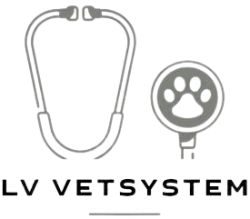
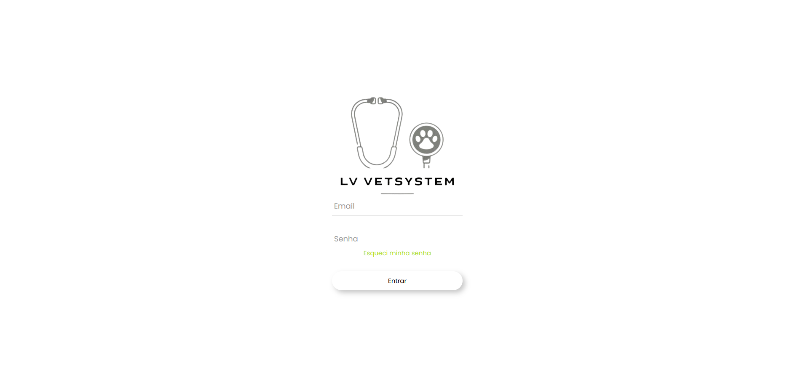
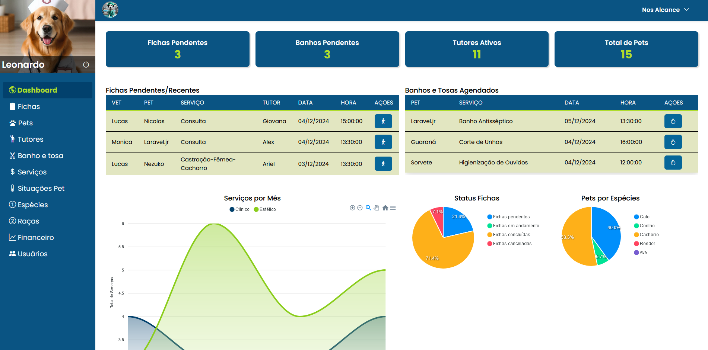
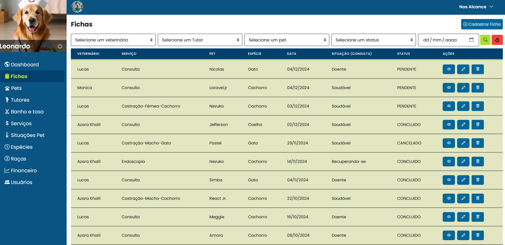

# 🐾 LV - VetSystem
<div align="center">
  
</div>

**LV - VetSystem** é uma aplicação desenvolvida para facilitar o gerenciamento de clínicas veterinárias. Com uma interface intuitiva, o sistema permite organizar informações sobre os animais, responsáveis, consultas e muito mais, otimizando o dia a dia de clínicas veterinárias de pequeno e médio porte.

---

## 📜 Conheça um pouco sobre nosso sistema

O **LV - VetSystem** é um sistema completo para o gerenciamento de clínicas veterinárias. Ele permite que você gerencie todas as informações relacionadas aos pacientes (animais), seus responsáveis (tutores), além de permitir o controle de consultas, histórico médico, serviços e muito mais. O sistema foi desenvolvido com o objetivo de otimizar o fluxo de trabalho das clínicas veterinárias, garantindo mais eficiência e agilidade no atendimento.

---

## 📸 Capturas de Tela

### Tela de Login


_A tela de login é simples e segura, permitindo o acesso ao sistema de forma rápida._

### Dashboard


_A interface moderna e fácil de usar permite o gerenciamento eficiente de dados._

### Tabela de Fichas


_A tabela de fichas organiza as informações de forma clara e acessível, facilitando a consulta aos dados dos pacientes._

---

## 🚀 Funcionalidades Principais

- Cadastro completo de pacientes (pets);
- Registro de informações dos responsáveis (tutores);
- Gestão de consultas, tratamentos e histórico médico;
- Controle de dados financeiros e serviços;
- Relatórios detalhados;
- Gestão de banhos e serviços estéticos;
- Hierarquia de usuário.

---

## 🛠 Tecnologias Utilizadas

- **Backend:** Laravel, PostgreSQL
- **Frontend:** Vue.js, JavaScript, HTML, CSS
- **Outros:** GitHub, Tailwind CSS, Bootstrap Icons

---

## 📝 Sobre o Projeto

Este projeto foi desenvolvido como Trabalho de Conclusão de Curso (TCC) para o curso de Sistemas para Internet, com o objetivo de criar uma solução prática e funcional para clínicas veterinárias.

**Autores:**  
Leonardo Maceira Santos e Vitor Inácio Izidório.  

**Orientador:**  
Alex Morgado Pereira.

---

## 🌟 Entre em contato conosco:

### Leonardo Maceira Santos  
📧 **E-mail:**  
- leonardo.maceira.santos@hotmail.com
  
📞 **WhatsApp:**  
- +55 (44) 9121-6753 

📸 **Instagram:**  
- [@leonardo_maceira](https://www.instagram.com/leonardo_maceira)  

---

### Vitor Inácio Izidório  
📧 **E-mail:**  
- vitorinacio16@gmail.com  

📞 **WhatsApp:**  
- +55 (44) 8431-8126

📸 **Instagram:**  
- [@vitorinacio16](https://www.instagram.com/vitorinacio16)  

---

## 🖥 Como Rodar o Projeto

Siga os passos abaixo para rodar o projeto localmente:

1. **Instale as dependências:**
   ```bash
     npm install
  
2. **Inicie o servidor de desenvolvimento:**
   ```bash
   npm run dev
---

Obrigado por conferir este repositório! 💻🎉
